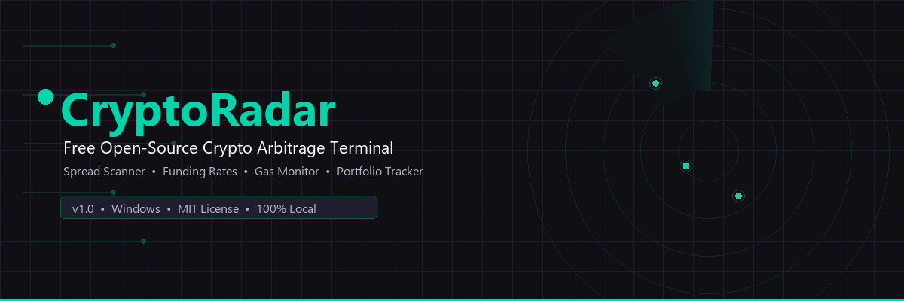
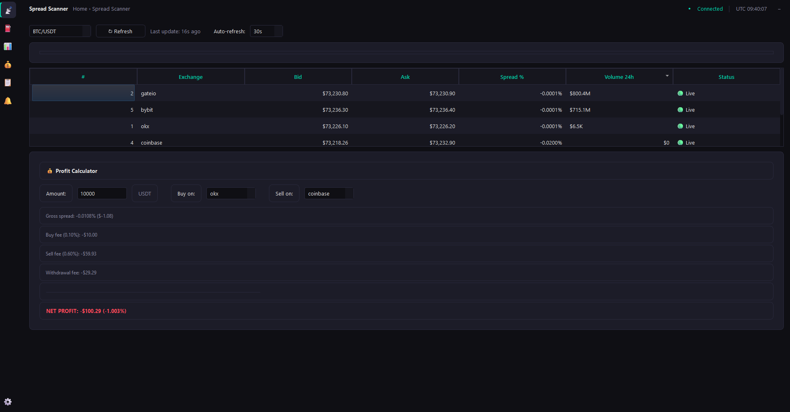
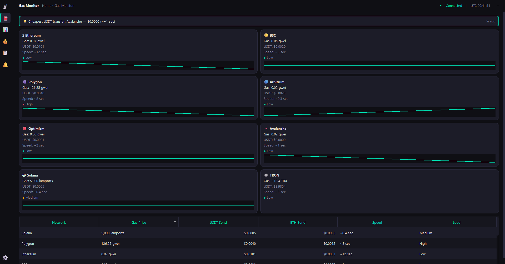
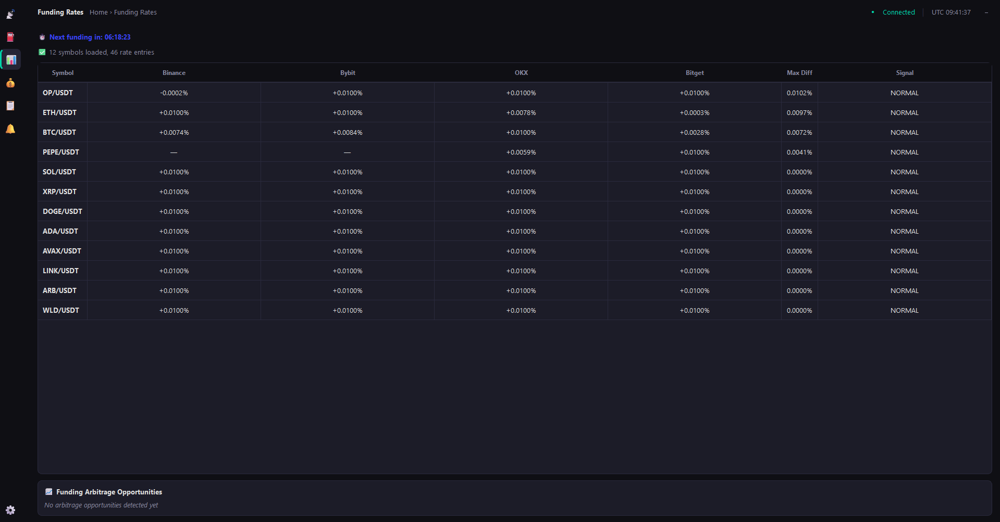
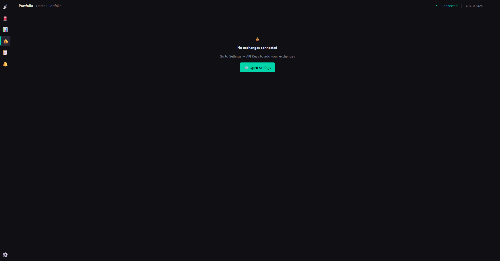
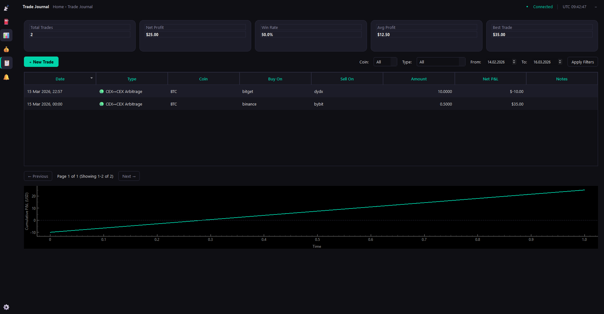
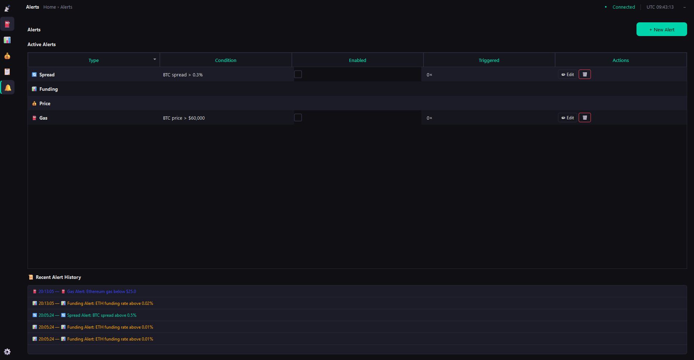

<!-- 
  SEO: Primary keywords: crypto arbitrage, bitcoin arbitrage tool, 
  cryptocurrency spread scanner, cross-exchange arbitrage, 
  funding rate monitor, open source trading terminal
  
  Recommended repository name: crypto-arbitrage-terminal
  Recommended About description (120 chars): 
  "Free open-source crypto arbitrage terminal — real-time spread 
  scanner, funding rates, gas monitor, portfolio tracker for Windows"
  
  Recommended Topics (add ALL of these in GitHub repo settings):
  crypto, arbitrage, bitcoin, ethereum, trading, cryptocurrency,
  ccxt, spread-scanner, funding-rate, gas-tracker, portfolio-tracker,
  trading-tools, windows, desktop-app, python, open-source,
  defi, altcoin, exchange, binance
-->

<div align="center">



<h1>🛰️ CryptoRadar — Crypto Arbitrage Terminal</h1>

<p>
<strong>Free, open-source cryptocurrency arbitrage scanner and trading terminal for Windows.</strong><br>
Real-time spread detection across 10+ exchanges • Funding rate monitor • Gas fee tracker • Portfolio dashboard • Trade journal • Clipboard malware protection — all in one desktop app, 100% local, no cloud, no subscription.
</p>

<p>

<a href="../../releases/latest">
  
</a>
<a href="../../stargazers">
  
</a>
<a href="LICENSE">
  
</a>
<a href="../../issues">
  
</a>


</p>

<p>
  <sub>
    If you find CryptoRadar useful, please consider 
    <a href="../../stargazers">⭐ giving it a star</a> — 
    it helps others discover this free tool!
  </sub>
</p>

</div>

---

<details open>
<summary><strong>📖 Table of Contents</strong></summary>

- [Why CryptoRadar?](#-why-cryptoradar)
- [Features](#-features)
  - [Spread Scanner](#-spread-scanner--cross-exchange-arbitrage-detector)
  - [Gas Fee Monitor](#-gas-fee-monitor--cheapest-transfer-network-finder)
  - [Funding Rate Monitor](#-funding-rate-monitor--cash-and-carry-arbitrage-signals)
  - [Portfolio Dashboard](#-portfolio-dashboard--multi-exchange-balance-tracker)
  - [Trade Journal](#-trade-journal--arbitrage-pnl-tracker)
  - [Smart Alerts](#-smart-alerts--never-miss-an-opportunity)
  - [Clipboard Guard](#-clipboard-guard--anti-clipper-malware-protection)
- [Supported Exchanges](#-supported-exchanges)
- [CryptoRadar vs Paid Alternatives](#-cryptoradar-vs-paid-alternatives)
- [Installation](#-installation)
  - [Download (Recommended)](#option-1-download-recommended)
  - [Build from Source](#option-2-build-from-source)
- [Configuration](#%EF%B8%8F-configuration)
- [Screenshots](#-screenshots)
- [Tech Stack](#-tech-stack)
- [Security & Privacy](#-security--privacy)
- [Roadmap](#-roadmap)
- [FAQ](#-frequently-asked-questions)
- [Contributing](#-contributing)
- [Support the Project](#-support-the-project)
- [Disclaimer](#%EF%B8%8F-disclaimer)
- [License](#-license)
- [See Also](#-see-also)

</details>

---

## 🤔 Why CryptoRadar?

**Crypto arbitrage traders juggle 10+ browser tabs every day** — checking spreads on CoinGecko, gas fees on Etherscan, funding rates on CoinGlass, balances on each exchange. Paid terminals like Coinigy ($19/mo) and Altrady ($31/mo) consolidate this, but they're expensive, cloud-based, and closed-source.

**CryptoRadar is the free, open-source alternative.** It brings everything into one Windows desktop application that runs 100% locally — no cloud accounts, no monthly fees, no data leaving your computer.

### The Problem

| Pain Point | How traders deal with it today |
|---|---|
| Checking prices across exchanges | 5+ browser tabs open 24/7 |
| Calculating real profit after fees | Mental math or spreadsheets |
| Monitoring gas fees for transfers | Refreshing Etherscan manually |
| Tracking funding rate anomalies | CoinGlass website, no alerts |
| Logging arbitrage trades | Google Sheets |
| Protecting against clipboard malware | Hope for the best 🙏 |

### The Solution

**CryptoRadar replaces all of that with a single app.**

---

## ✨ Features

### 📡 Spread Scanner — Cross-Exchange Arbitrage Detector

Real-time price comparison of any cryptocurrency across 10+ centralized exchanges. Instantly spot when Bitcoin is cheaper on Binance than on Kraken, or when an altcoin has an exploitable spread between OKX and Coinbase.



- **Live price table** — bid, ask, spread %, volume for each exchange
- **Best opportunity highlight** — automatically finds the most profitable buy→sell pair
- **Net profit calculator** — factors in trading fees, withdrawal fees, and network costs
- **Auto-refresh** — 10s / 30s / 60s intervals
- **16 coins supported** — BTC, ETH, SOL, XRP, DOGE, ADA, AVAX, MATIC, DOT, LINK, UNI, ATOM, ARB, OP, PEPE, WLD

### ⛽ Gas Fee Monitor — Cheapest Transfer Network Finder

Know exactly which blockchain network is cheapest and fastest for your USDT transfer RIGHT NOW. Stop overpaying for transactions.



- **8 networks monitored** — Ethereum, BSC, Polygon, Arbitrum, Optimism, Avalanche, Solana, TRON
- **USDT transfer cost** — real-time cost in USD for each network
- **Speed estimates** — confirmation time per network
- **Congestion indicator** — Low / Medium / High with color coding
- **Sparkline charts** — gas price history for the last hour
- **Smart recommendation** — "Cheapest right now: TRON — $0.30"

### 📊 Funding Rate Monitor — Cash-and-Carry Arbitrage Signals

Track perpetual futures funding rates across Binance, Bybit, OKX, and Bitget. Detect anomalies that signal cash-and-carry arbitrage opportunities or cross-exchange funding arbitrage.



- **4 futures exchanges** — Binance, Bybit, OKX, Bitget
- **12+ perpetual pairs** — BTC, ETH, SOL, DOGE, and more
- **Anomaly alerts** — 🔥 when |rate| > 0.05%, 🚨 when > 0.1%
- **Cross-exchange diff** — find funding arb (long on one exchange, short on another)
- **Annualized rates** — see the yearly yield equivalent
- **Countdown timer** — time until next funding payment

### 💰 Portfolio Dashboard — Multi-Exchange Balance Tracker

See all your crypto balances across every exchange in one screen. No more logging into 5 different exchanges to check your total holdings.

- **Read-only API keys** — your funds stay safe
- **Encrypted storage** — API keys encrypted with Fernet (AES)
- **Asset breakdown** — by coin and by exchange
- **USD valuation** — real-time total portfolio value
- **CSV export** — download your balances anytime
- **10 exchanges supported** — Binance, Bybit, OKX, KuCoin, Kraken, Gate.io, MEXC, HTX, Coinbase, Bitget

### 📋 Trade Journal — Arbitrage P&L Tracker

Log every arbitrage trade and track your performance over time. Built specifically for arbitrage workflows — not generic trading journals.

- **Trade types** — CEX↔CEX arbitrage, DEX↔CEX arbitrage, funding rate, other
- **Auto fee calculation** — knows fees for each exchange
- **Performance stats** — win rate, average profit, best trade
- **P&L chart** — cumulative profit/loss over time
- **Filters** — by coin, type, date range
- **Full CRUD** — add, edit, delete trades

### 🔔 Smart Alerts — Never Miss an Opportunity

Set custom conditions and get Windows desktop notifications the instant an opportunity appears.

- **Spread alerts** — "Notify me when BTC spread > 0.3%"
- **Gas alerts** — "Notify me when ETH gas < 15 gwei"
- **Funding alerts** — "Notify me when any funding > 0.05%"
- **Price alerts** — "Notify me when SOL > $200"
- **Cooldown system** — avoid notification spam
- **Alert history** — full log of all triggered alerts

### 🛡️ Clipboard Guard — Anti-Clipper Malware Protection

Protects you from clipboard hijacking malware that silently replaces crypto addresses you copy. This is a real threat — millions have been stolen through clipper trojans.

- **Real-time monitoring** — checks clipboard every 500ms
- **Address detection** — Bitcoin, Ethereum, TRON, Solana, and more
- **Hijack alert** — INSTANT red warning if address changes
- **Auto-restore** — puts your original address back
- **Address book** — save trusted addresses, get green confirmation when they're copied
- **Always-on** — runs silently in system tray

---

## 🏦 Supported Exchanges

| Exchange | Spread Scanner | Portfolio | Funding Rates |
|----------|:-:|:-:|:-:|
| Binance | ✅ | ✅ | ✅ |
| Bybit | ✅ | ✅ | ✅ |
| OKX | ✅ | ✅ | ✅ |
| KuCoin | ✅ | ✅ | — |
| Kraken | ✅ | ✅ | — |
| Gate.io | ✅ | ✅ | — |
| MEXC | ✅ | ✅ | — |
| HTX (Huobi) | ✅ | ✅ | — |
| Coinbase | ✅ | ✅ | — |
| Bitget | ✅ | ✅ | ✅ |

Powered by [ccxt](https://github.com/ccxt/ccxt) — the most popular open-source crypto exchange library with support for 100+ exchanges.

---

## ⚖️ CryptoRadar vs Paid Alternatives

| Feature | CryptoRadar | Coinigy ($19/mo) | Altrady ($31/mo) | 3Commas ($49/mo) |
|---------|:-:|:-:|:-:|:-:|
| Cross-exchange spread scanner | ✅ | ✅ | ✅ | ❌ |
| Net profit calculator (with fees) | ✅ | ❌ | ❌ | ❌ |
| Gas fee monitor | ✅ | ❌ | ❌ | ❌ |
| Funding rate monitor | ✅ | ❌ | ❌ | ❌ |
| Portfolio tracker | ✅ | ✅ | ✅ | ✅ |
| Trade journal | ✅ | ❌ | ✅ | ❌ |
| Custom alerts | ✅ | ✅ | ✅ | ✅ |
| Clipboard malware protection | ✅ | ❌ | ❌ | ❌ |
| Works offline | ✅ | ❌ | ❌ | ❌ |
| Open source | ✅ | ❌ | ❌ | ❌ |
| No account required | ✅ | ❌ | ❌ | ❌ |
| Data stored locally | ✅ | ❌ | ❌ | ❌ |
| **Price** | **FREE** | **$228/yr** | **$372/yr** | **$588/yr** |

---

## 📥 Installation

### Option 1: Download (Recommended)

1. Go to the [**Releases**](../../releases/latest) page
2. Download `CryptoRadar-v1.0.0-windows-x64.zip`
3. Extract to any folder
4. Run `CryptoRadar.exe`
5. (Optional) Enable "Start with Windows" in Settings

> **Requirements:** Windows 10/11 (64-bit)  
> **No Python installation needed** — everything is bundled.

### Option 2: Build from Source

```bash
# Clone the repository
git clone https://github.com/billy-crypto-coder/crypto-arbitrage-terminal.git
cd crypto-arbitrage-terminal

# Create virtual environment
python -m venv venv
venv\Scripts\activate

# Install dependencies
pip install -r requirements.txt

# Run the application
python main.py

# (Optional) Build standalone .exe
python build.py
```

> **Requirements:** Python 3.11+, Windows 10/11, Git

---

## ⚙️ Configuration

### API Keys (Optional — for Portfolio only)

CryptoRadar works out of the box WITHOUT any API keys. Spread Scanner, Gas Monitor, Funding Rates, and Alerts all use public data.

API keys are ONLY needed for the Portfolio Dashboard:

1. Go to **Settings → Exchange API Keys**
2. Add your exchange API key (read-only!)
3. Click **Test Connection** to verify
4. Your keys are encrypted and stored locally

> ⚠️ **IMPORTANT:** Always create READ-ONLY API keys.  
> Never grant trading or withdrawal permissions.  
> CryptoRadar never needs to make trades on your behalf.

### Settings

| Setting | Default | Options |
|---------|---------|---------|
| Auto-refresh | 30s | Off, 10s, 30s, 60s |
| Display currency | USD | USD, EUR, GBP |
| Start with Windows | Off | On/Off |
| Minimize to tray | On | On/Off |
| Clipboard Guard | On | On/Off |
| Sound alerts | On | On/Off |

---

## 📸 Screenshots

<details>
<summary>Click to view all screenshots</summary>

| Spread Scanner | Gas Monitor |
|:-:|:-:|
|  |  |

| Funding Rates | Portfolio |
|:-:|:-:|
|  |  |

| Trade Journal | Alerts |
|:-:|:-:|
|  |  |

</details>

---

## 🛠 Tech Stack

| Component | Technology |
|-----------|-----------|
| Language | Python 3.11 |
| GUI Framework | PySide6 (Qt6) |
| Exchange Data | [ccxt](https://github.com/ccxt/ccxt) |
| Charts | [pyqtgraph](https://github.com/pyqtgraph/pyqtgraph) |
| Database | SQLite (built-in) |
| Encryption | [cryptography](https://github.com/pyca/cryptography) (Fernet/AES) |
| Packaging | PyInstaller |

---

## 🔒 Security & Privacy

CryptoRadar is designed with a **privacy-first** approach:

- 🔐 **Local-only storage** — all data stays on YOUR computer
- 🔐 **Encrypted API keys** — Fernet (AES-128) encryption
- 🔐 **No telemetry** — zero tracking, zero analytics, zero phone-home
- 🔐 **No accounts** — no registration, no email, no cloud
- 🔐 **No network requests** except to exchanges — verify in source code
- 🔐 **Open source** — audit every line of code yourself
- 🔐 **Read-only API keys** — the app never trades or withdraws on your behalf

> We believe your trading data and strategies are private. CryptoRadar will NEVER send your data anywhere.

---

## 🗺 Roadmap

- [x] Spread Scanner with real-time price comparison
- [x] Gas fee monitor for 8+ networks
- [x] Funding rate anomaly detector
- [x] Portfolio dashboard with encrypted API keys
- [x] Trade journal with P&L analytics
- [x] Custom alert system with Windows notifications
- [x] Clipboard hijack protection
- [ ] DEX price integration (Uniswap, PancakeSwap, Raydium)
- [ ] Triangular arbitrage scanner
- [ ] Telegram alert integration
- [ ] Multi-language UI (DE, FR, ES, RU, ZH)
- [ ] macOS and Linux support
- [ ] Whale transaction alerts
- [ ] On-chain analytics integration
- [ ] Auto-screenshot sharing (with watermark)

Have a feature request? [Open an issue](../../issues/new)!

---

## ❓ Frequently Asked Questions

<details>
<summary><strong>Is CryptoRadar free?</strong></summary>

Yes, CryptoRadar is 100% free and open-source under the MIT license. There are no paid tiers, no premium features, and no subscriptions. Everything is included.

</details>

<details>
<summary><strong>Is crypto arbitrage still profitable in 2025?</strong></summary>

Yes. While large spreads are rare on major pairs, opportunities still exist — especially on altcoins, between smaller exchanges, and through funding rate arbitrage. CryptoRadar helps you spot these opportunities in real-time instead of manually checking each exchange.

</details>

<details>
<summary><strong>Do I need API keys to use CryptoRadar?</strong></summary>

No. The Spread Scanner, Gas Monitor, Funding Rates, and Alerts all work using public exchange data — no API keys needed. API keys are only required for the Portfolio Dashboard feature, and they must be read-only.

</details>

<details>
<summary><strong>Is my data safe?</strong></summary>

Yes. All data is stored locally on your computer. API keys are encrypted using Fernet (AES-128) encryption. CryptoRadar makes no network requests except to cryptocurrency exchanges for price data. There is no telemetry, no cloud storage, and no user accounts. The code is open-source — you can verify this yourself.

</details>

<details>
<summary><strong>Can CryptoRadar execute trades automatically?</strong></summary>

No. CryptoRadar is an information and monitoring tool only. It shows you opportunities — you decide whether and how to act on them. This is by design for safety.

</details>

<details>
<summary><strong>What is clipboard hijacking and how does CryptoRadar protect against it?</strong></summary>

Clipboard hijacking (clipper malware) is when malicious software monitors your clipboard and replaces cryptocurrency addresses you copy with the attacker's address. If you paste without double-checking, you send funds to the attacker. CryptoRadar's Clipboard Guard monitors your clipboard in real-time and instantly alerts you if an address is replaced after copying.

</details>

<details>
<summary><strong>Which exchanges are supported?</strong></summary>

Binance, Bybit, OKX, KuCoin, Kraken, Gate.io, MEXC, HTX (Huobi), Coinbase, and Bitget. The Spread Scanner works with public data from all 10. Funding Rates are tracked on Binance, Bybit, OKX, and Bitget. We plan to add DEX support (Uniswap, PancakeSwap, Raydium) in a future release.

</details>

<details>
<summary><strong>Does CryptoRadar work on macOS or Linux?</strong></summary>

Currently, CryptoRadar is optimized for Windows 10/11. macOS and Linux support is on the roadmap. Since it's built with Python and PySide6 (Qt), the codebase is cross-platform — contributors are welcome to help test and package for other operating systems.

</details>

<details>
<summary><strong>How is CryptoRadar different from other arbitrage bots on GitHub?</strong></summary>

Most crypto arbitrage projects on GitHub are either (1) command-line scripts without a GUI, (2) focused on automated trading bots, or (3) abandoned/outdated. CryptoRadar is a complete desktop application with a modern UI, designed for manual traders who want to FIND opportunities — not auto-trade. It also includes unique features like the Clipboard Guard, Gas Monitor, and Funding Rate tracker that other tools lack.

</details>

---

## 🤝 Contributing

Contributions are welcome! Here's how you can help:

1. 🍴 **Fork** the repository
2. 🌿 Create a feature branch: `git checkout -b feature/my-feature`
3. 💻 Make your changes
4. ✅ Test thoroughly
5. 📤 Submit a Pull Request

### Areas where help is needed:
- 🌍 **Translations** — help translate to German, French, Spanish, Russian, Chinese
- 🐛 **Bug reports** — [open an issue](../../issues/new)
- 📈 **New exchanges** — add support for more exchanges
- 🍎 **macOS/Linux** — help with cross-platform packaging
- 📖 **Documentation** — improve wiki and guides

See [CONTRIBUTING.md](CONTRIBUTING.md) for detailed guidelines.

---

## ⭐ Support the Project

CryptoRadar is free and will always be free. If it saves you time or money, here's how you can support the project:

- ⭐ **Star this repository** — helps others discover the tool
- 🐛 **Report bugs** — helps improve quality
- 💡 **Request features** — shapes the roadmap
- 🤝 **Contribute code** — make it even better
- 📢 **Share with friends** — spread the word on Twitter, Reddit, BitcoinTalk, Telegram

---

## ⚠️ Disclaimer

CryptoRadar is provided for **informational and educational purposes only**. It is NOT financial advice.

- Past arbitrage performance does not guarantee future results
- Cryptocurrency trading involves significant risk of loss
- Always do your own research (DYOR) before making trades
- The developers are not responsible for any financial losses
- Use read-only API keys — never grant withdrawal permissions
- This software is provided "as is" without warranty

---

## 📄 License

This project is licensed under the [MIT License](LICENSE) — you're free to use, modify, and distribute it.

---

## 🔗 See Also

- [ccxt](https://github.com/ccxt/ccxt) — CryptoCurrency eXchange Trading Library
- [Freqtrade](https://github.com/freqtrade/freqtrade) — Free open-source crypto trading bot
- [Hummingbot](https://github.com/hummingbot/hummingbot) — Open-source market making and arbitrage bot
- [Crypto Arbitrage Framework](https://github.com/hzjken/crypto-arbitrage-framework) — Arbitrage path finder with linear programming

---

<div align="center">
  
**Built with ❤️ for the crypto community**

<a href="../../stargazers">
  
</a>

<sub>
CryptoRadar is not affiliated with any cryptocurrency exchange. All exchange names and logos are trademarks of their respective owners.
</sub>

</div>
